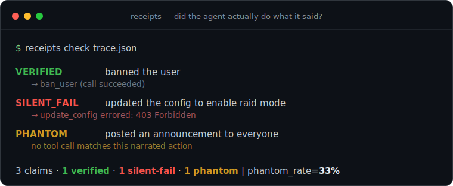

# receipts

**Your agent said "done — I banned the user and updated the config." Did it actually?**
`receipts` checks the story against the tool calls.

[](#tests)
[](LICENSE)
[](pyproject.toml)
[](pyproject.toml)

<p align="center">
  
</p>

---

## Why this exists

LLM agents narrate their work in fluent natural language. That prose is *not*
evidence. Two failure modes hide inside a confident "done":

- **Phantom actions** — the model says it did something it never called a tool for.
- **Silent failures** — the tool call *did* run, but it errored (or returned
  nothing) and the model reported success anyway.

Both are invisible if you only read the final message, and both are exactly the
kind of thing that burns you in production ("it said it banned them…"). `receipts`
reconciles the **claims** in the assistant's text against the **actual tool-call
trace** and flags the gaps. It runs fully offline — no model, no network, no GPU.

It also **measures its own accuracy** on a hand-labeled fixture set and publishes
the numbers (see [How honest is it?](#how-honest-is-it)). The extractor is a
heuristic, not magic, and the docs say so.

## Install

```bash
pip install .          # from a clone
# or, for development:
pip install -e ".[dev]"
```

No third-party dependencies. Python 3.9+.

## Quickstart

```python
from receipts import load_trace, check_trace

trace  = load_trace(my_trace_json)   # native schema, or use from_openai_messages
report = check_trace(trace)
print(report.render())               # human-readable per-claim verdicts
print(report.phantom_rate)           # 0.33
```

Or from the command line:

```bash
receipts check examples/demo_trace.json      # exits 1 if anything is phantom/failed
```

## Example output

Running the bundled demo (`receipts check examples/demo_trace.json`), where the
agent claims three actions — one real, one that silently failed, one it never
attempted:

```
receipts: demo
=============
  [OK  ] VERIFIED    banned the user
            -> ban_user  (call succeeded)
  [XX  ] SILENT_FAIL updated the config to enable raid mode
            -> update_config  (tool errored: 403 Forbidden: missing Manage Server permission)
  [??  ] PHANTOM     posted a heads up in announcements so everyone
            no tool call matches this narrated action

  3 claim(s): 1 verified, 1 phantom, 1 silent-fail  |  phantom_rate=33%
```

`--json` gives you the same result as structured data for CI or dashboards.

## How it works

Four small, readable stages — no ML:

1. **`trace.py`** — normalizes input into a `Trace` (turns → assistant text +
   `tool_calls`, tool results linked by `tool_call_id`). Loads a simple native
   JSON schema, or adapts an OpenAI-Chat `messages` list via `from_openai_messages`.
2. **`claims.py`** — extracts *action claims* from assistant prose using a curated
   table of past-tense action verbs (`banned`, `created`, `deleted`, `sent`,
   `fetched`, `merged`, …) plus an object noun-phrase. Intentions ("I'll ban…"),
   negations ("I did not delete…"), and idioms ("all set") are deliberately excluded.
3. **`reconcile.py`** — matches each claim to a tool call (verb aligns with the
   tool name; object words break ties; **each call backs at most one claim**) and
   classifies it **VERIFIED / PHANTOM / SILENT_FAIL** by inspecting the call's result.
4. **`report.py`** — per-run report + `phantom_rate`, and a corpus-level
   aggregate across many runs.

### Trace schema (native)

```json
{
  "turns": [
    {"role": "assistant", "text": "banning now",
     "tool_calls": [{"id": "c1", "name": "ban_user", "arguments": {"user_id": "42"}}]},
    {"role": "tool",
     "results": [{"tool_call_id": "c1", "output": "User 42 banned.", "error": null}]},
    {"role": "assistant", "text": "done — i banned the user"}
  ]
}
```

A result is treated as a failure when it has a non-empty `error`, an empty
`output`, or output text that reads like an error ("permission denied", "not
found", …).

## How honest is it?

The claim extractor is heuristic, so `receipts` ships a small **hand-labeled gold
set** (`fixtures/labeled/`) and scores itself against it. Reproduce anytime:

```bash
receipts selfeval
```

Measured on the current gold set (**10 traces, 16 labeled claims**):

| metric | value |
|---|---|
| extraction precision | 1.00 |
| extraction recall | 1.00 |
| classification accuracy | 1.00 |
| PHANTOM precision / recall | 1.00 / 1.00 |
| SILENT_FAIL precision / recall | 1.00 / 1.00 |

**Read this honestly:** these are strong numbers *on a tiny, in-repo set that the
heuristics were tuned against*. They are a regression floor, not a claim of
real-world accuracy. On unseen traces, expect the extractor to miss verbs outside
its table and to occasionally mis-scope an object phrase. The gold set exists so
that (a) you can see exactly where the tool fails, and (b) CI catches any change
that degrades it. PRs that add harder fixtures are very welcome.

## Limitations

- **Heuristic extraction.** Claims are found via a curated verb table, not a
  parser. Verbs not in the table (e.g. "pinned", "archived") are missed; unusual
  phrasing can mis-scope the object. This is by design — it keeps the tool
  offline, fast, and fully inspectable — but it means recall is not 100% on real text.
- **Matching is lexical.** A claim matches a call when the claim's action shares a
  token with the tool name. A tool named `moderate` won't match "banned" even if
  that's what it does. Rename-heavy or opaquely-named tools reduce recall.
- **Failure detection is conservative and string-based.** An explicit `error`
  field is authoritative; beyond that, `receipts` looks for failure words in the
  output. A tool that returns `"No errors found"` could be misread, and a tool
  that reports failure only via a status code you didn't surface will be missed.
- **One call per claim.** If a single tool call legitimately backs two separately
  narrated claims, the second is flagged PHANTOM. Rare, but possible.
- **No semantics.** `receipts` checks *that* a matching action happened, not that
  it did the *right* thing (correct user, correct value). It is a tripwire, not a proof.

## Roadmap

- Optional **LLM-based claim extractor** as a drop-in alternative to the heuristic
  one (same interface, higher recall, requires a model — off by default).
- More **trace adapters** (Anthropic tool-use, LangChain/LangGraph, generic
  OpenTelemetry spans).
- Argument-level reconciliation (did the claimed *object* match the call's *args*?).
- A larger, community-contributed gold set with per-domain breakdowns.

## Tests

```bash
pip install -e ".[dev]"
python -m pytest -q
```

Fully offline — no network, no model, no GPU. Includes the self-eval test that
enforces the accuracy floors above.

## License

MIT © 2026 insomniac-asif
